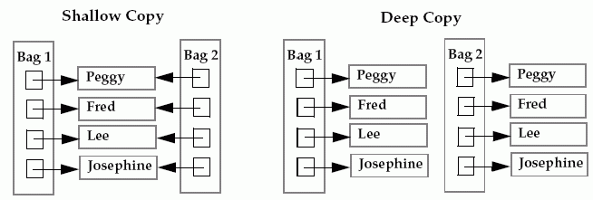

# 2주차: Built in type

# Python3 Type hierarchy


[https://en.wikipedia.org/wiki/Data_type](https://en.wikipedia.org/wiki/Data_type)

- Primitive data types
    - boolean
    - Numeric types (int, float, complex)
    - iterator types
- Sequence types
    - **List**
    - **Tuple**
    - **Ranges**
- Mapping types
    - **Dictionary**
- Set types
    - **set**
    - **frozenset**

# Sequence

---

## List

---

### 정의 및 특징

```python
ls = [1, 2, 3, 4]
ls
# output: [1, 2, 3, 4]

type(ls)
# output: <class 'list'>
```

- 순서가 있는 수정, 삭제, 추가가 가능한 객체의 집합입니다.
- 내부 요소를 수정 가능합니다. (mutable)
- list는 대괄호(`[]`)로 작성되어지며 내부 원소는 콤마(`,`)로 구분됩니다.

- 여러가지 타입이 하나의 리스트에 포함되는 것이 가능합니다.

    ```python
    ['abcdef', 354, True]
    ```

- 리스트 생성은 list 클래스로 객체를 생성해도 되고 대괄호로 표기할 수 있습니다.

    ```python
    ls1 = [1, 2, 3]
    ls2 = list([1, 2, 3, 4])
    ```

### 리스트 슬라이스

[슬라이스(Slice).md](./Built-in-Types/슬라이스(Slice).md)

### 리스트 정렬(Sort)

[리스트 정렬(Sort).md](./Built-in-Types/리스트_정렬(Sort).md)

### List에서 사용 가능한 연산 및 함수

[list_operations.md](./Built-in-Types/list_operations.md)
- [가능한 연산 및 함수 종류](./Built-in-Types/list_operations.csv)

## Tuple

---

### 정의 및 특징

```python
t1 = ()
t2 = (1,)
t3 = (1, 2, 3)
t4 = 1, 2, 3
t5 = ('a', 'b', ('ab', 'cd'))
```

- tuple은 괄호(`()`)로 작성되어지며 내부 요소는 콤마(`,`)로 구분됩니다.
- 1개의 요소만 가지는 튜플은 요소뒤에 꼭 콤마(`,`)를 붙여야 합니다.
- `t4`처럼 괄호를 생략해도 무방합니다.

리스트와 형태가 거의 비슷하나, 튜플은 리스트와 달리 불변성(Immutable)을 가집니다.
즉, 한 번 선언한 튜플은 내부 값의 수정이 불가능합니다.

```python
t1 = (1, 2, 'a', 'b')
del t1[0]
```

```
Traceback (most recent call last):
  File "<stdin>", line 1, in <module>
TypeError: 'tuple' object doesn't support item deletion
```

### 튜플 다루기 예시

- 인덱싱

    ```python
    t1 = (1, 2, 'a', 'b')
    t1[0]
    # output: 1
    ```

- 슬라이싱

    ```python
    t1 = (1, 2, 'a', 'b')
    t1[1:]
    # output: (2, 'a', 'b')
    ```

- 튜플 더하기 (Concat)

    ```python
    t1 = (1, 2, 'a', 'b')
    t2 = (3, 4)
    t1 + t2
    # output: (1, 2, 'a', 'b', 3, 4)
    ```

- 튜플 곱하기 (Multiply)

    ```python
    t2 = (3, 4)
    t2 * 3
    # output: (3, 4, 3, 4, 3, 4)
    ```

- 튜플 길이 구하기

    ```python
    t1 = (1, 2, 'a', 'b')
    len(t1)
    ```

### 네임드튜플(namedtuple)

일반적으로 튜플에 있는 요소들을 접근하기 위해서는 인덱스로 접근해야합니다.

네임드 튜플을 사용하면 내부에 있는 요소를 접근할 때 인덱스로도 접근가능하고 키로도 접근가능한 Collection module입니다.

```python
# Basic example
Point = namedtuple('Point', ['x', 'y'])     # namedtuple 정의
p = Point(11, y=22)                         # 키워드 인자를 통한 생성

# indexable like the plain tuple (11, 22)
output1 = p[0] + p[1]                       
print('result1: {}'.format(output1))

# unpack like a regular tuple
a, b = p                
print('result2: {}'.format((a, b)))

# fields also accessible by name
print('result3: {}'.format(p.x + p.y))

# readable __repr__ with a name=value style
print(p)
```

CSV등에서 데이터를 읽어올 때 csv의 컬럼명과 매치시켜 유용하게 사용할 수 있습니다.

- csv에서 데이터 읽어오기 예제

    

    ```python
    import collections as coll
    import csv

    # Create a new tuple type with the name AfterSalesRecord
    SalesRecord = coll.namedtuple('AfterSalesRecord', 'make, units, totalusd');

    # Create a CSV reader
    csvReader   = csv.reader(open("namedtuple_sample.csv", "rt")); 

    # Make a namedtuple for each record from the CSV file
    print("Contents of the CSV file:");

    for sales in map(SalesRecord._make, csvReader):
        print(sales.make, sales.units, sales.totalusd);
    ```

## Range

---

전달받은 인자를 바탕으로 순차적인 숫자를 가지는 range를 생성할 수 있으며, 
list를 생성하거나 for문 등에서 사용할 수 있습니다.

- `range(stop)`
    - start가 생략되면 기본값으로 0이 지정
    - 0 ~ (stop - 1)까지의 요소를 가지는 리스트를 생성

        ```python
        range(10)
        # output: range(0, 10)

        range(0, 10)
        # output: range(0, 10)
        ```

    - 반복문에서의 사용

        ```python
        for i in range(10):
            print(i)
        ```

    - range는 값을 확인하기 위해서는 다른 Iterable한 자료형으로 변환해야합니다.

        ```python
        list(range(10))
        # output: [0, 1, 2, 3, 4, 5, 6, 7, 8, 9]
        ```

- `range(start, stop[, step])`
    - step은 증가 값 → start에 step을 더해가며 stop까지 반복합니다.
    - step이 생략되면 기본값으로 1로 지정됩니다.
    - step에 0을 지정하는 것은 불가능합니다. (0 지정시 ValueError 발생)

        ```python
        list(range(4, 10))                                 # (1)
        # output: [4, 5, 6, 7, 8, 9]

        list(range(1, 10, 3))                              # (2)
        # output: [1, 4, 7]

        list(range(20, 10, -2))                            # (3)
        # output: [20, 18, 16, 14, 12]
        ```

        ```java
        List<Integer> list1 = new ArrayList<>();      // (1)
        for (int i = 1; i < 10; i += 3) {
        	list1.add(i);
        }

        List<Integer> list2 = new ArrayList<>();      // (2)
        for (int i = 1; i < 10; i += 3) {
        	list2.add(i);
        }

        List<Integer> list3 = new ArrayList<>();      // (3)
        for (int i = 20; i > 10; i -= 2) {
        	list3.add(i);
        }
        ```

# Map

---

## Dictionary

### 정의 및 예시

- 딕셔너리 타입은 immutable한 key와 mutable한 value의 쌍들로 구성되는 집합입니다.
- key로는 immutable한 값은 사용할 수 있지만, mutable한 객체는 사용할 수 없습니다.
    1. immutable한 키값 예시

        ```python
        {"a": 1, "b": 2}        # string key
        {1: 12, 23: 2}          # int key
        {(1,5): 5, (3,3): 3}    # tuple key
        ```

    2. mutable한 키값 예시

        ```python
        { {1, 3}: 5, {3,5}: 3}      # set key
        { [1, 3]: 5, [3,5]: 3}      # list key
        { {"a": 1}: 5, "abc": 3}    # dict key
        ```

        ```
        Traceback (most recent call last):                     
          File "<stdin>", line 1, in <module>
        TypeError: unhashable type: 'set'               # set key

        Traceback (most recent call last):
          File "<stdin>", line 1, in <module>
        TypeError: unhashable type: 'list'              # list key

        Traceback (most recent call last):
          File "<stdin>", line 1, in <module>
        TypeError: unhashable type: 'dict'              # dict key
        ```

### dictionary 변환

- 중첩 리스트나 중첩 튜플을 dictionary 생성 인자로 전달하면 dictionary로 변환 가능

    ```python
    name_and_ages = [['alice', 5], ['Bob', 13]]
    dict(name_and_ages)
    # output: {'alice': 5, 'Bob': 13}

    name_and_ages = [('alice', 5), ('Bob', 13)]
    dict(name_and_ages)
    # output: {'alice': 5, 'Bob': 13}

    name_and_ages = (('alice', 5), ('Bob', 13))
    dict(name_and_ages)
    # output: {'alice': 5, 'Bob': 13}

    name_and_ages = (['alice', 5], ['Bob', 13])
    dict(name_and_ages)
    # output: {'alice': 5, 'Bob': 13}
    ```

### pprint를 통해 map 보기 편하게 출력

- 단순 print

    ```python
    a = {'alice': [1, 2, 3], 'bob': 20, 'tony': 15, 'suzy': 30,"dodo": [1,3,5,7], "mario": "pitch"}
    print(a)

    # {'alice': [1, 2, 3], 'bob': 20, 'tony': 15, 'suzy': 30, 'dodo': [1, 3, 5, 7], 'mario': 'pitch'}
    ```

- pprint 사용

    ```python
    from pprint import pprint as pp
    a = {'alice': [1, 2, 3], 'bob': 20, 'tony': 15, 'suzy': 30,"dodo": [1,3,5,7], "mario": "pitch"}
    pp(a)

    # {'alice': [1, 2, 3],
    # 'bob': 20,
    # 'dodo': [1, 3, 5, 7],
    # 'mario': 'pitch',
    # 'suzy': 30,
    # 'tony': 15}
    ```

## Shallow copy & Deep copy



### 1. 단순 객체 복제

```python
a = [1, 2, 3, 4]
b = a                # shallow copy 발생
print(b)             # [1, 2, 3, 4]
b[2] = 100           # b의 item 변경
print(b)             # [1, 2, 100, 4]
print(a)             # [1, 2, 100, 4], a의 item도 수정됨!!
```

리스트를 선언하고 a에 할당하였습니다.

그러면 a 는 리스트 객체의 주소를 바라보는 변수가 됩니다. 
이후 a 를 b 에 할당해 주었습니다. 그러면 b 는 a 와 같은 객체의 주소를 바라보게 됩니다.

문제는 a 또는 b 를 수정하게 되면 문제가 발생합니다. 
위에서 처럼 b 의 세번째(2) 값을 3 에서 100 으로 바꿔주게 되면, 당연히 b 는 [1, 2, 100, 4] 처럼 출력됩니다. 

그런데 변경되지 않을 거라고 예상했던 a 또한 b 와 같이 [1, 2, 100, 4] 로 수정되어버렸습니다. 
이는 a 와 b 가 동일한 객체를 참조하기 때문에 발생하는 문제입니다.

한가지 주의할 점은 위의 경우처럼 복사된 참조 변수를 수정했을때, 처음에 할당한 참조 변수의 값 역시 똑같이 수정되는 것은 리스트와 같은 변경가능(mutable) 객체일 때만 해당한다는 것입니다. 

숫자나 문자열과 같은 불변의(immutable) 객체일때는 위의 경우가 해당되지 않습니다.

```python
a = 10
b = a
print(b)    # 10 출력
b = "abc"
print(b)    # abc 출력
print(a)    # 10 출력
```

### 2. Shallow copy

```python
import copy

a = [1, [1, 2, 3]]
b = copy.copy(a)    # shallow copy 발생
print(b)            # [1, [1, 2, 3]] 출력
b[0] = 100
print(b)            # [100, [1, 2, 3]] 출력,
print(a)            # [1, [1, 2, 3]] 출력, shallow copy 가 발생해 복사된 리스트는 별도의 객체이므로 item을 수정하면 복사본만 수정된다. (immutable 객체의 경우)

c = copy.copy(a)
c[1].append(4)      # 리스트의 두번째 item(내부리스트)에 4를 추가
print(c)            # [1, [1, 2, 3, 4]] 출력
print(a)            # [1, [1, 2, 3, 4]] 출력, a가 c와 똑같이 수정된 이유는 리스트의 item 내부의 객체는 동일한 객체이므로 mutable한 리스트를 수정할때는 둘다 값이 변경됨
```

리스트 내에 리스트가 있는 경우에 얕은 복사(b = copy.copy(a))가 이뤄지더라도 리스트 내의 내부 리스트까지 별도의 객체로 복사가 되는것은 아닙니다.

### 3. Deep copy

```python
import copy

a = [1, [1, 2, 3]]
b = copy.deepcopy(a)    # deep copy 실행
print(b)    # [1, [1, 2, 3]] 출력
b[0] = 100
b[1].append(4)
print(b)    # [100, [1, 2, 3, 4]] 출력
print(a)    # [1, [1, 2, 3]] 출력
```

mutable한 내부객체의 문제를 해결하기 위해서는 얕은 복사가 아닌 깊은 복사를 수행해야합니다.

얕은 복사가 복합객체(리스트)만 복사되고 그 안의 내용은 동일한 객체를 참조한다면, 깊은 복사의 경우에는 복합객체를 새롭게 생성하고 그 안의 내용까지 재귀적으로 새롭게 생성하게 됩니다.

파이썬에서는 copy 모듈의 deepcopy()라는 메서드를 통해 깊은 복사를 손쉽게 사용할 수 있습니다.