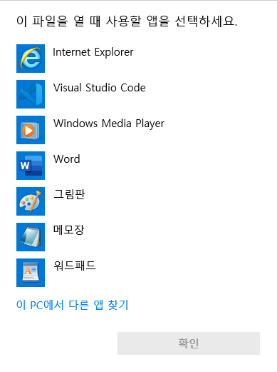

# file and binary

## 2진수와 16진수
```
컴퓨터는 반도체소자들의 집합체이며 각 소자들은 전류가 흐르면 1 흐르지 않으면 0을 표현합니다.(2진법사용)
즉 컴퓨터는 0과1을 모든것을 처리해야 하며 파일역시 0과1을 이용하여 저장됩니다.

하나의 0이나 1을 1bit라고 하며 이것이 8개가 모이면 1byte라고 합니다.
1111은 10진수로 15(1+2+4+8)이며 16진수으로 F입니다.
1byte(8bit) 11111111은 10진수로 255(1+2+4+8+16+32+64+128)이며 16진수로 FF(16*15+15)입니다. 

1byte의 내용을 확인하기 위해서는 11111111 총 8자리의 2진수를 써야하지만 16진수로는 단 2자리 FF만 사용하면 되므로
보통 16진수 2자리에 1byte를 표현합니다.(16진수는 접두사로 0x를 붙여주는 경우가 많습니다. 0xff)

1byte는 8bit 
2진수로 1 ~ 11111111
10진수로 1 ~ 256
16진수로 1 ~ 0xff
```

## UNICODE
- 유니코드는 인코딩방식이 아니라 모든 문자를 2bytes의 숫자로 매핑시키는 방식입니다.(65536개(2^16), 유니코드3.0부터 110만개 이상)
- 컴퓨터상에서 우리눈에 보이는 모든 문자,특수기호들은 모두 UNICODE에 매핑되어있습니다.
- 유니코드 여러가지로 표현하는 인코딩 방식이 존재합니다.(ASCII, UTF-8 등)

## 대표적인 문자 인코딩 종류
- ASCII
    - 7bit를 사용하여 영어,숫자,특수문자를 표현(2**7이므로 128까지)
    - A는 American의 약자로 영어를 위해 만들어진 문자입니다.
- ANSI
    - 8bit로 구성되어 256개의 문자를 표현합니다.
    - ANSI = ASCII + CodePage(1bit)
- UTF-8
    - 유니코드를 위한 가변 길이 문자 인코딩(한글은 3byte 영어는 1byte ASCII는 그대로)
    - ANSI의 단점을 보완한 방식입니다.

## txt에디터로 file을 직접 만들어 확인
- 1A를 txt파일에 입력하고 저장합니다.
- 아래의 명령어로 인코딩과 byte를 확인합니다.
- [아스키코드표](https://mblogthumb-phinf.pstatic.net/20160211_209/ansdbtls4067_1455192707460IhXKg_JPEG/ASCII_Code_%25EC%259D%25BC%25EB%259E%258C%25ED%2591%259C_-_%25EC%259E%2591%25EC%2584%25B1%25EC%259E%2590_-_%25EB%2595%259C%25EC%2593%25B0001.png?type=w800) 를 보고 확인합니다.

```sh
# charset이 ASCII인것을 확인할 수 있습니다.
$ file -i [filename]
test.txt: text/plain; charset=us-ascii

# 3141 이 저장되었습니다.
# 31는 문자1을 41은 문자A를 나타내는 16진수입니다.
# 3141이 들어가있습니다(31,41은 1A)
# 우측에는 ASCII로 디코드 해서 나온 문자들을 보여줍니다.
$ xxd [filename]
00000000: 3141                                     1A

# 1byte를 16진수 두자리로 보는게 싫고 
# 2진수로 보고싶다면(8개의 bit를 보고싶다면) -b 옵션을 입력합니다.
$ xxd -b [filename]
00000000: 00110001 01000001                                      1A
```
## 한글을 저장하고 확인
- txt파일에 ㄱ을 추가로 입력하고 저장한후 확인합니다.
```sh
# charset이 utf-8로 변경되었습니다.(유니코드를 utf-8로 인코딩해서 저장됐습니다. 
# 툴(메모장, vscode, intellij, atomm 등)이 자동으로 utf-8로 설정하여 저장해준겁니다.
$ file -i [filename]
test.txt: text/plain; charset=utf-8

# ASCII 코드는 8byte가 아니라 7byte만 사용합니다.(하나의 비트는 다른 용도로 사용)
# 따라서 최대숫자는 7F이고 앞자리에 7보다 큰 수(8,9,a,b,c,d,e)가 들어간다면 ascii코드의 인코딩은 깨지게됩니다.
# 우측은 ASCII로 디코딩 된 문자를 보여주는데 ...은 세개의 문자가 꺠진겁니다.
# 이 바이너리들을 열때는 UTF-8로 열어줘야 한글이 정상적으로 표시됩니다.
# 툴(메모장)이 보통 해줍니다.
$ xxd [filename]
00000000: 3141 e384 b1                             1A...
```

## 확장자란?
- 파일의 형식이나 종류를 구분하기 위해 사용합니다.
- 파일명뒤에 .을 찍고 알파벳을 붙여서 사용합니다.
- 운영체제는 이 확장자를 보고 어떤 툴로 이 파일을 열지 결정합니다.
- 확장자가 없거나 확장자에 맞는 디코딩툴이 없다면 아래와 같은 창을 띄워줍니다.



## txt 파일이란?
- 바이너리파일을 ascii utf 등으로 디코드하여 읽는 파일입니다.
- 유니코드를 특정 방식으로 인코딩하여 바이너리로 저장되는 파일입니다.

```
사람은 바이너리를 읽을 수 없기때문에 툴의 도움을 받아 읽습니다.
운영체제는 txt라는 확장자를 가진 파일을 특정한 툴(ex 메모장)을 이용해 열어줍니다.
확장자를 입력하지 않으면 어떤툴을 이용해서 열지 선택할 수 있습니다.
그림판을 선택하면 열리지 않습니다. 
```
## 내가 만든 바이너리가 그림판으로 열리지 않는 이유
- file signature(magic number)가 틀렸기 때문입니다.
- [file signature](https://blog.naver.com/PostView.nhn?isHttpsRedirect=true&blogId=gaegurijump&logNo=110186211008&parentCategoryNo=&categoryNo=42&viewDate=&isShowPopularPosts=true&from=search) 는 해당사이트에서 확인할 수 있습니다.
```
운영체제의 그림판, 파워포인트, 어도비, 웹 브라우저 같은 툴은 file signature(magic number)를 확인한 후 열어줍니다.
파일의 확장자를 변경해서 운영체제에게 그 툴로 여는거라고 알려줘봐야 filesignature가 맞지않아 열리지 않습니다.
pdf파일은 웹브라우저 or 어도비로, pptx는 파워포인트로, png파일은 그림판으로, html파일은 웹 브라우저로 열어야 합니다.
```

## 메모장으로 파일을 저장할때 파일 시그니쳐를 넣어주면 해당 툴로 열수 있을까
- 가능한것도 있고 가능하지 않은것도 있습니다.

## PNG로 저장해서 그림판으로 열기
```
아스키코드는 7bit로 7F가 최대크기입니다. 파일시그니쳐가 그 이상의 값을 갖고있지 않다면 메모장에서 손쉽게 조작이 가능합니다. 
png는 첫 바이트부터 ef라 그림판은 메모장 등의 에디터로 조작이 불가능합니다.
binary코드를 메모장으로 직접 열어서라도 복사하려고 확인하는 순간 파일서명은 깨져버리며, 
다시는 그림판으로 조차 열수 없는 파일이 되버립니다.
```

## 메모장으로 가능한것들
- html이나, xml파일이 가능합니다.
```
html은 파일서명이 3C 21 44 4F 43 54 ... 입니다. 
앞자리가 7이하의 숫자이므로 모두 아스키로 표현(메모장에서 표현)이 가능합니다.
해당 아스키코드가 의미하는 문자를 찾아 메모장에 첫줄에 입력해주고 저장,
확장자를 html로 변경하면 웹브라우저로 열수 있습니다. 
```
## html과 xml의 file signature를 ASCII로 디코딩한 결과
<details><summary>click</summary>
<p>

```xml
<!DOCTYPE html>
<?xml version="1.0" encoding="UTF-8"?>
```

</p>
</details>
<br>
<br>
<br>

## int vs char(1)
- int는 4byte char는 1byte로 사용됩니다.
- char에는 숫자와 문자를 모두 넣을수 있는데 1byte밖에 사용하지 않습니다.
- int는 숫자만 쓸수있으면서 4byte나 사용합니다.

## 4byte에 표현할 수 있는 숫자
- char를 사용했을때 4byte에 넣을수 있는 가장 큰수
    - <details><summary>click</summary>
        <p>

        ```
        1byte에 문자를 하나씩 표현하므로 9를 네개 이어붙이면 가장 큽니다.
        십진법(문자): 9999
        십육진법: (0x39 0x39 0x39 0x39)
        이진법: 0111001 4번 반복
        ```

        </p>
        </details>
- int를 사용했을때 4byte에 넣을수 있는 가장 큰수
    - <details><summary>click</summary>
        <p>

        ```
        4byte는 32bit이므로 총 
        2^32  = 4,294,967,296 의 수를 표현할 수 있습니다.(정확히는 2^32 -1)
        그중 반은 음수, 반은 양수를 표현한다고 생각하면 
        32칸의 2진수로 나타낼수 있는 가장 큰수는
        4,294,967,296 / 2 = 2,147,483,648 쯤 됩니다.
        (정확한 int32 의 범위는 –2,147,483,648 ~ 2,147,483,647 입니다.)

        십진법(숫자): 2,147,483,647
        십육진법:  (0xff 0xff 0xff 0xff)
        이진법 : 11111111 4번 반복
        ```

        </p>
        </details>

## int vs char(2)
- 같은 물리적 공간을 사용하더라도 모든 숫자(bit)를 진짜 숫자로 사용 vs 일정한 숫자(bit)를 문자로 해석(ASCII 등으로 디코딩)해서 사용
- tcp, udp 등의 통신에서 8자리의 숫자를 담는데 누구는 4byte를 사용하고 누구는 8byte를 사용할지도 모릅니다.

## char의 binary를 읽거나, 쓰는 방법
- char형은 메모장등 열어서 확인할수 있고 메모장을 수정해서 저장하면 됩니다.

## int의 binary를 읽거나 쓰는 방법
- python의 struct를 사용합니다.(binary를 조작하므로 당연히 int, char, float 등 모두 가능합니다.)