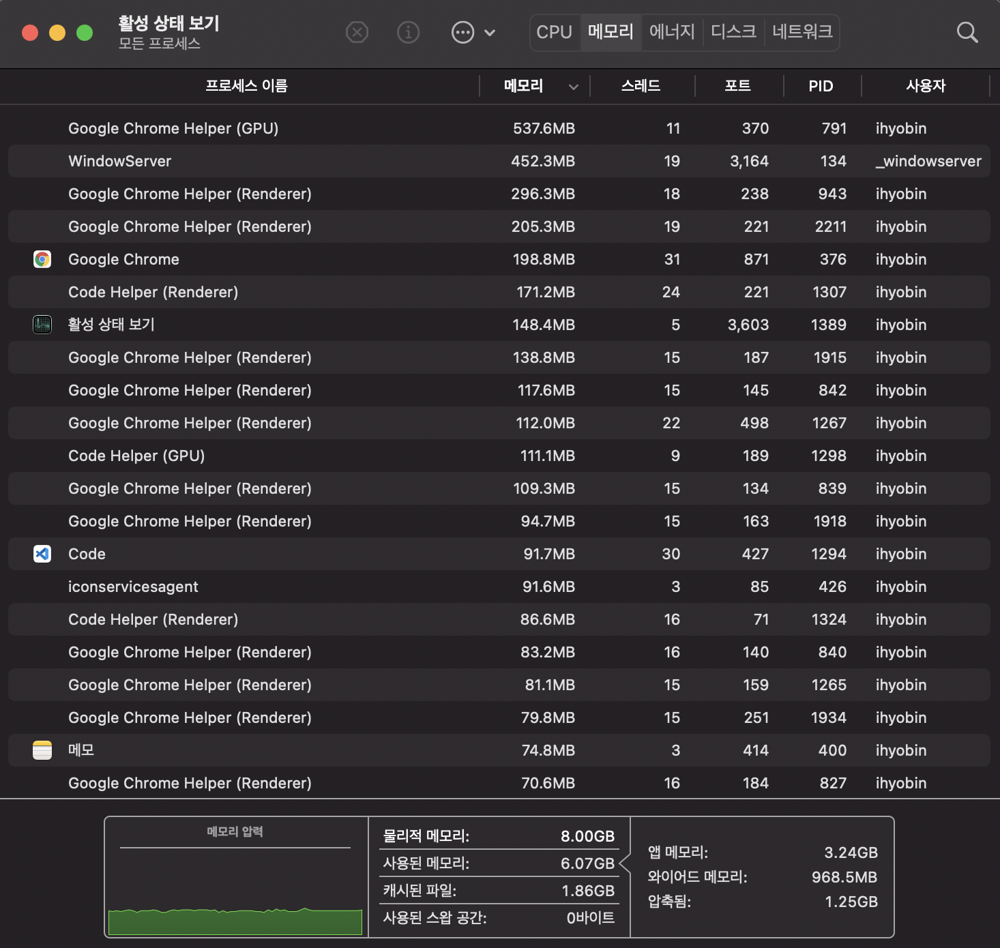
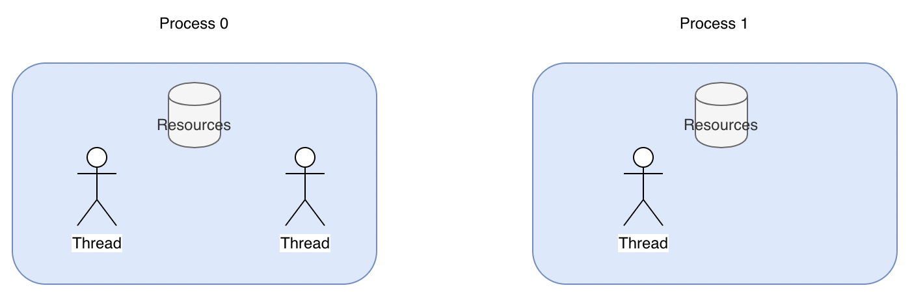

# Thread 

## 1. 프로세스와 스레드

어떤 프로그램이 실행중인 상태를 Process 라고 한다. 



위와 같이 하나의 컴퓨터에서 많은 프로세스 들을 함께 실행시키는 multi-processing 작업을 하기 위해서 동시적(concurrency) 또는 병렬적(Parallelism) 프로그래밍 개념이 사용됩니다.

<br><br>


### <b>동시성 vs 병렬성</b>

<br>

```동시성``` <br>

동시성은 프로세서 하나가 여러 작업을 번갈아 가면서 실행하는 것이다. '동시' 단어와 어울리지 않게 보이겠지만 운영체제가 이 번갈아 가는 과정을 빠르게 처리해 주기 때문에 사용자의 입장에서는 동시에 여러 작업이 처리되는 것 처럼 보인다. (context switching)

<br>

```병렬성``` <br>

병렬성은 프로세서 하나에 여러 코어가 달려서 각각 병렬적으로 작업들을 실행하는 것이다. <br>
 <br>
듀얼코어, 쿼드코어, 옥타코어 와 같이 하드웨어에 멀티코어 프로세서가 달린 컴퓨터에서 활용할 수 있는 방식. <br>
CPU의 속도가 발열 등의 물리적 제약으로 인해 발전에 한계가 있자 그 대신에 코어를 여러개 달아서 작업을 나누어 할 수 있게 만든 것이다. 

<br><br>

---

## 2. 그렇다면, Thread 란?




운영체제가 생성하는 작업 단위를 Process라고 한다. 이 Process 안에서 공유되는 메모리를 바탕으로 여러 작업을 또 생성할 수 있는데, 이 때의 작업 단위를 Thread라고 한다. <br>
웹브라우저에서 유튜브로 음악을 들으며 검색을 하는 상황을 생각해 보자. 
구글 chrome 프로세스 안에 생성된 여러 스레드가 각각 'youtube'를 실행하고 '검색 창을 보여주는' 것이다. <br>
각 Thread 마다 할당된 개인적인 메모리가 있으면서, Thread가 속한 Process가 가지는 메모리에도 접근할 수 있다. <br>

Python 에는 GIL(Global Interpreter Lock) 이라는 것이 있어서, 하나의 process 내에 여러개의 Thread가 병렬적으로 실행될 수 없다. 멀티코어 CPU 에서 동작한다고 하더라도 하나의 프로세스는 동시에 여러 코어를 사용할 수 없다는 것이다. <br>

따라서 Python 에서 여러 Thread 동시에 처리하(도록 보이)기 위해서는 동시성의 개념을 활용해야 한다. <br>

<br><br>

---

## 3. Thread 활용

파이썬은 기본적으로 single-thread 방식이기 때문에 Thread 를 여러개 사용하기 위해서는 threading 모듈을 사용하여 구현해야한다.

<br>

``` th = Thread(target={스레드가 사용할 함수}, args={함수의 인자}) ```


threading 모듈의 Thread 함수로 쓰레드 객체를 받아 사용한다. target은 쓰레드가 실행할 함수, args는 그 함수의 인자들을 의미한다. start 함수로 쓰레드를 시작하고 join 함수로 쓰레드가 끝날 때까지 기다린다. 

<br>

### 첫번째 예시 

이 함수를 10번 실행한다고 생각해보자

```py
def do_something():
    print('Sleeping 1 seconds')
    time.sleep(1)
    print('Done Sleeping...')
```


```py
# single-thread로 작성
import time

if __name__ == '__main__':
    start = time.perf_counter()
    for _ in range(10):
        do_something()
    finish = time.perf_counter()
    
    print(f'Finished in {round(finish-start, 2)} second(s)')
```

```sh
Finished in 10.02 second(s)
```

<br>


```py
# multi-thread로 작성

import time
import threading
 
if __name__ == '__main__':
    start = time.time()
    threads = []
    for _ in range(10):
        t = threading.Thread(target=do_something)
        t.start()
        threads.append(t)
        
    for thread in threads:
        thread.join()
 
    print(f'Finished in {round(time.time()-start, 2)} second(s)')
```

```sh
Finished in 1.01 second(s)
```

---

### 두번째 예시

1부터 100,000,000 까지의 합을 구하는 계산 프로그램을 만들어보자

```py
import time
from threading import Thread

def work(id, start, end, result):
    total = 0
    for i in range(start, end):
        total += i
    result.append(total)
    return

if __name__ == "__main__":
    start = time.time()
    START, END = 1, 100000000
    result = list()

    # 하나의 스레드로 실행
    th1 = Thread(target=work, args=(1, START, END, result))
    
    th1.start()
    th1.join()

    # 두개의 스레드로 실행 
    # th1 = Thread(target=work, args=(1, START, END//2, result))
    # th2 = Thread(target=work, args=(2, END//2, END, result))
    
    # th1.start()
    # th2.start()
    # th1.join()
    # th2.join()

print(f"Result: {sum(result)}")
print("time :", time.time() - start)
```

<br>

---

## 4. 파이썬의 GIL(Global Interpreter Lock) 정책

두번째 예시를 실행해보면 기대와 달리 성능에 큰 차이를 보이지 않는다. 이는 Python의 GIL 정책 때문이다. 

언어에서 자원을 보호하기 위해 락(Lock) 정책을 사용하고 그 방법 또한 다양하다. 파이썬에서는 하나의 프로세스 안에 모든 자원의 락(Lock)을 글로벌(Global)하게 관리함으로써 한번에 하나의 쓰레드만 자원을 컨트롤하여 동작하도록 한다.

위의 코드에서 result 라는 자원을 공유하는 두 개의 쓰레드를 동시에 실행시키지만, 결국 GIL 때문에 한번에 하나의 쓰레드만 계산을 실행하여 실행 시간이 비슷한 것이다.


<br>

<details>
<summary>Python 에서 GIL 을 선택한 이유</summary>
<div markdown="1">

<br>
Python 인터프리터는 객체에 참조가 생기거나 해제될 때마다 reference 의 개수를 증감 방법으로 메모리를 관리한다. <br> 이때 쓰레드간에 공유하는 객체가 있다면 객체를 참조하는 연산(=) 은 경쟁상태 즉, race condition이 되고 메모리가 유실되는 등의 상황이 발생할 수 있다. <br>
이를 해결하기 위해 mutex 와 lock을 걸 수 있지만 정수 변수 하나까지 객체로 다루는 파이썬에서 이렇게 객체마다 lock을 걸어야 한다면 매우 비효율적이 될 수 있으며 deadlock과 같은 위험상황을 야기할 수 있다. <br><br>

```따라서 Python에서는 mutex를 통해 모든 reference를 일일이 보호하는 것이 아니라 python 인터프리터 자체에 락을 걸어버렸다.``` Thread가 몇개건 CPU 코어에 관계없이 Python 인터프리터를 사용하는 쓰레드는 오직 하나가 되도록 만든 것이다. 당연히 특정 객체에 대한 동시 접근은 해결될 수 있다. 그러나 이것은 얼마나 많은 Thread를 사용하던지에 상관없이 오직 한 Thread만이 Python 코드를 실행할 수 있다는 의미이기도 하다.


</div>
</details>

<br><br>


## 그렇다면 Python에서는 Multithreading을 언제 써야할까?

<br>

 <br>

||I/O 바운드 프로세스|CPU 바운드 프로세스|
|--|--|--|
|작업 비중| 프로그램이 Network Connection, 하드 디스크 와 같은 <br>외부 장치들과 통신하는 데 대부분의 시간을 쓴다.| 프로그램이 CPU의 계산작업에 대부분의 시간을 쓴다.
|개선 방향| <br>외부 장치의 응답을 기다리는 대기 시간들을 잘 겹쳐보자 | 같은 시간에 더 많은 계산을 하게 만들어보자

<br><br>

프로그램을 개발하다보면 속도 저하 등 성능상의 이슈가 생기면 동시성을 프로그램에 추가하고 싶어진다. <br> 이때 이 프로그램이 데이터를 처리(계산)하는데 시간을 많이 쓰는 CPU 바운드 프로그램인지, 프로그램 외부의 input/output 작업을 대기하는 데 대부분의 시간을 쓰는 I/O 바운드 프로그램인지 파악하는 것이 필요하다. <br>
GIL이 적용되는 것은 <b>CPU 동작</b>에서이고 쓰레드가 CPU 동작을 마치고 <b>I/O 작업</b>을 실행하는 동안에는 다른 쓰레드가 cpu 동작을 동시에 실행할 수 있다. <br>
```따라서 cpu 동작이 많지 않고 I/O동작이 더 많은 프로그램에서는 멀티 쓰레드만으로 성능 향상 효과를 얻을 수 있다.```
예를 들면 HTTP requests와 같은 I/O bound가 많은 작업은 응답을 기다리는 시간이 대부분이기 때문에 multithreading으로 구현하면 성능이 향상된다. <br><br>

---

### 참고 : Python에서도 하나의 쓰레드로 동시처리를 하는 비동기 프로그래밍을 할 수 있다.

웹 서버와 같은 어플리케이션에서는 CPU 연산보다 DB나 API 연동 과정에서 발생하는 대기시간이 길다. 즉 I/O 바운드 프로그램에 가깝다. 비동기 프로그램은 이러한 대기시간을 낭비하지 않고 그 시간에 CPU가 다른 처리를 할 수 있도록 non-blocking 하게 만들어준다. 이는 자바스크립트와 같은 언어에서 구현되던 방식이었는데 python 에서도 I/O 바운드 프로그램에서 성능향상을 목적으로 사용될 수 있다. <br>
asyncio 방식은 싱글 쓰레드 이기 때문에 dead lock, race condition, 오버헤드 등의 문제가 발생하지 않고 네트워크 처리에 있서 성능이 좋은 편이다. 

  

---

<br><br>
CPU 바운드 프로그램이라면 threading과 asyncio 모듈은 큰 도움이 되지 않았다. 따라서 python의 GIL을 우회 하는 multi-processing 모듈을 사용하여 개선해 볼 수 있다. 


[참고 1](https://seoyeonhwng.medium.com/synchronous-vs-multiprocessing-vs-multithreading-vs-asyncio-w-%ED%8C%8C%EC%9D%B4%EC%8D%AC-e88c6d16b29a) <br>
[참고 2](https://nachwon.github.io/asyncio-futures/)

<br>

# 의문점
GIL 이 있는데 왜 Lock() 을 쓰는가
[원본](https://stackoverflow.com/questions/40072873/why-do-we-need-locks-for-threads-if-we-have-gil)

하나의 스레드 내에 여러 흐름이 있다. (read, calc, write 등) 이는 코드의 흐름에 따라 생기는 절차인데, GIL 의 경우 이 하나하나의 작업에 대해서 공유 메모리에 동시에 접근하지 않도록 막아주는 lock이다. <br>
그런데 만약에 하나의 프로세스가 calc을 하고 write를 하기 전에 다른 스레드의 read가 해당 메모리를 읽어버릴 수 있다. (이 부분은 당연히 각각의 read, calc, write는 동시에 하지 못하도록 GIL이 보장해주어서 GIL 은 할일을 다함. 얘잘못 아님) 이 순서 안에 다른 스레드가 끼어들 수 없도록 해주는 것이 Lock()의 개념이다.

### Lock() 


한 프로세스 내에서 여러 스레드가 자원을 공유하게되면 문제가 생길 수 있다. 하나의 자원에 두개 이상의 스레드가 접근하게 되는 경우가 그 예시이다.

```sh
self.some_number += 1
```

위 코드의 흐름을 생각해보면 
1. ```self.some_number ``` 이라는 값을 읽고,
2. ```self.some_number + 1``` 을 계산하고,
3. ```self.some_number ``` 에 쓴다(write)

그런데 이 작업을 두개 이상의 스레드로 하게 된다면 각 흐름이 섞이게 된다.

```
thread1 reads self.some_number (0)
thread2 reads self.some_number (0)
thread1 calculates some_number+1 (1)
thread2 calculates some_number+1 (1)
thread1 writes 1 to self.some_number
thread2 writes 1 to self.some_number
```

따라서 lock 이라는 개념을 활용하여 해당 흐름의 순서를 강제해 줄 수 있다. Lock은 python threading패키지에서 지원한다. lock을 acquire하면 해당 쓰레드만 공유 데이터에 접근할 수 있고, lock을 release 해야만 다른 쓰레드에서 공유 데이터에 접근할 수 있다.

```
thread1 reads self.some_number (0)
thread1 calculates some_number+1 (1)
thread1 writes 1 to self.some_number
thread2 reads self.some_number (1)
thread2 calculates some_number+1 (2)
thread2 writes 2 to self.some_number
```

<br>

```py
import threading
import time

total = 0
lock = threading.Lock()

# lock을 사용하지 않음
def increment_n_times(n):
    global total
    for i in range(n):
        total += 1

# lock 을 사용하여 자원을 보호
def safe_increment_n_times(n):
    global total
    for i in range(n):
        lock.acquire()
        total += 1
        lock.release()

def increment_in_x_threads(x, func, n):
    threads = [threading.Thread(target=func, args=(n,)) for i in range(x)]
    global total
    total = 0
    begin = time.time()
    for thread in threads:
        thread.start()
    for thread in threads:
        thread.join()
    print('finished in {}s.\ntotal: {}\nexpected: {}\ndifference: {} ({} %)'
           .format(time.time()-begin, total, n*x, n*x-total, 100-total/n/x*100))

print('unsafe:')
increment_in_x_threads(70, increment_n_times, 100000)

print('\nwith locks:')
increment_in_x_threads(70, safe_increment_n_times, 100000)
```

<br>
결과

```sh
unsafe:
finished in 0.4746110439300537s.
total: 6017108
expected: 7000000
difference: 982892 (14.041314285714279 %)

with locks:
finished in 4.629594802856445s.
total: 7000000
expected: 7000000
difference: 0 (0.0 %)
```


<br>
<br>


# 다음 이야기 

## multiprocessing

결론적으로 말하자면, 파이썬에서 병렬처리를 구현하는 방식은 두가지로 멀티 쓰레드를 사용하거나 멀티 프로세스를 사용하는 것이다. 쓰레드는 가볍지만 GIL로 인해 계산 처리를 하는 작업은 한번에 하나의 쓰레드에서만 작동하여 cpu 작업이 적고 I/O 작업이 많은 병렬 처리 프로그램에서 효과를 볼 수 있다. <br>

이러한 상황에서 계산을 병렬로 처리하는데 도움을 주는 것이 바로 multiprocessing 모듈이다. multiprocessing 모듈은 쓰레드 대신 프로세스를 만들어 병렬로 동작한다. <br>

프로세스는 각자가 고유한 메모리 영역을 가지기 때문에 더 많은 메모리를 필요로 하지만, 각각 프로세스에서 병렬로 cpu 작업을 할 수 있고 이를 이용해 여러 머신에서 동작하는 분산 처리 프로그래밍도 구현할 수 있다. <br>

각자의 장단점을 고려하여 자신의 프로그램에 잘 맞는 방식을 사용하자.

<br><br>


# 참고 링크
[파이썬 멀티 쓰레드(thread)와 멀티 프로세스(process)](https://monkey3199.github.io/develop/python/2018/12/04/python-pararrel.html) 


[synchronous VS multiprocessing VS multithreading VS asyncio](https://seoyeonhwng.medium.com/synchronous-vs-multiprocessing-vs-multithreading-vs-asyncio-w-%ED%8C%8C%EC%9D%B4%EC%8D%AC-e88c6d16b29a)


[파이썬 Thread와 GIL 에 대한 이해](https://thrillfighter.tistory.com/621)


[[python] GIL, Global interpreter Lock](https://ssungkang.tistory.com/entry/python-GIL-Global-interpreter-Lock%EC%9D%80-%EB%AC%B4%EC%97%87%EC%9D%BC%EA%B9%8C)

[왜 파이썬에는 GIL 이 있는가](https://dgkim5360.tistory.com/entry/understanding-the-global-interpreter-lock-of-cpython)

[python의 동시성](https://nachwon.github.io/asyncio-futures/)