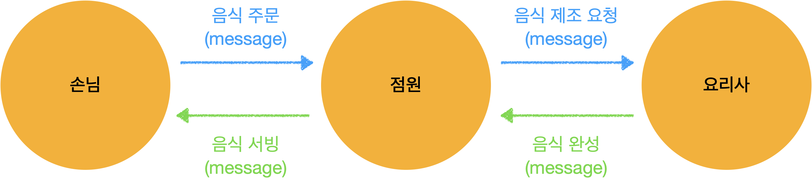
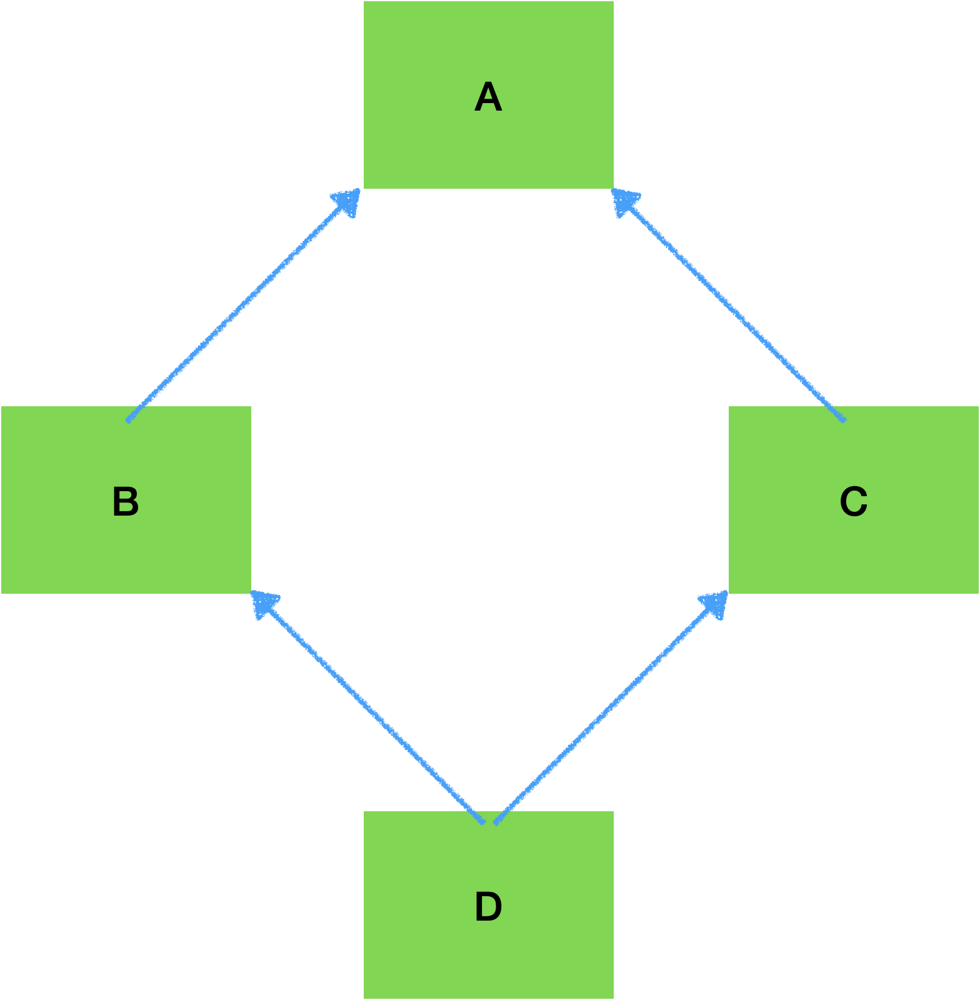

# Python class, dunder method

- [예제로 사용한 스크립트 파일들 참고](../script)

## 1. OOP (Object Oriented Programming)

- 객체 지향 프로그래밍

- 각각의 객체(object) 는 **역할**, **책임** 을 가지고 서로 **협력** 하여 동작한다.

  - 책임(역할): 각 객체는 적절한 역할을 수행 할 책임이 부여된다.

  - 협력적: 요청에 대해서 응답을 해주는 역할(책임) 을 갖고 있다.
    - 객체간 의사소통은 단 한가지 message 로만 가능하다.
  - 자율적: 요청의 처리에 대해서는 마음대로 한다.
    - 객체의 메소드가 수신된 메세지를 처리한다.

  

- 왜 객체지향 프로그래밍을 할까

  - 관리/수정 이 편하다
  - 프로그램 확장이 편하다
  - 객체를 재사용 할 수 있다.

- 일반적으로 class = object 를 동일시 하는 경향이 있다.

  - 하지만, class 는 객체를 코드로 옮기는 도구 이다.

- object(객체) 와 instance(인스턴스)

  - class
    - object 를 코드로 표현하기 위한 도구
  - object(객체)
    - class 를 이용해서 객체의 모양을 구현한 것
  - instance(인스턴스)
    - class 로 구현된 object 가 실제 메모리영역(힙영역) 에 할당 된 것

## 2. python class 문법

### 2-1. class 문법 스타일

```python
# new/old style 구분은 python 2.2 부터 구분
# python 3.x 부터는 내부적으로 무조건 object 를 자동으로 상속, 아래모든 내용이 동일하다.
class MyClass(object):
  pass
class MyClass():
  pass
class MyClass:
  pass
```

### 2-2. 생성자 (constructor)

- 메모리를 할당하여 값을 초기화 해주는 것
- `__init__`
  - 생성자라고 하기에는 애매한 점이 있다.
    - 클래스 object 에 메모리를 할당하지 않기 때문
  -  `__init__` 메소드는 속성 값을 초기화 해주는 일을 한다.
  - initializer
- `__new__`
  - 클래스 object 를 생성(메모리 할당) 을 하고 반환한다.
    - 하지만 메모리 할당 만으로 생성자라고는 하지 않는다.
  - instantiator(인스턴시에이터)
- 즉, 파이썬에는 `__new__`, `__init__` 메소드가 동작하여 객체가 생성된다.
- 예제코드

```python
class MyClass(object):
    def __new__(cls, *args, **kwargs):
        print('__new__ is called')
        return super().__new__(cls, *args, **kwargs)

    def __init__(self):
        print('__init__ is called')
        self.alpha = 1
print('== start ==')
mc = MyClass()

'''
== start ==
__new__ is called
__init__ is called
'''
```

### 2-3. 소멸자 (destructor)

- python 은 `__del__` 이라는 소멸자가 미리 정의 되어있다.
- 이 메소드의 내용은 개발자가 변경이 불가능하다.
- `del` 로 인스턴스를 삭제 할때 `__del__` 이 수행된다.

```python
class MyClass(object):
    def __new__(cls, *args, **kwargs):
        print('__new__ is called')
        return super().__new__(cls, *args, **kwargs)

    def __init__(self):
        print('__init__ is called')
        self.alpha = 1

    def __del__(self):
        print('__del__ is called')
print('== start ==')
mc = MyClass()
del mc

'''
== start ==
__new__ is called
__init__ is called
__del__ is called
'''
```

### 2-4. 생성자를 이용한 싱글톤 예제

- 싱글톤: 처음 인스턴스 생성시 메모리에 할당 해놓고, 다음 부터는 생성된 메모리를 참조해서 같은 인스턴스를 가져오는 방법

```python
class SingletonClass(object):
    _instance = None

    def __new__(cls, *args, **kwargs):
        if cls._instance is None:
            print('__new__ is first called')
            cls._instance = super().__new__(cls)
        else:
            print('__new__ is second called')
        return cls._instance

    def __init__(self, alpha: int):
        self.alpha = alpha

print('== start ==')
a = SingletonClass(1)
print(a, a.alpha)
b = SingletonClass(2)
print(b, b.alpha)
print(a, a.alpha)

'''
== start ==
__new__ is first called
<__main__.SingletonClass object at 0x103ccd7c0> 1
__new__ is second called
<__main__.SingletonClass object at 0x103ccd7c0> 2
<__main__.SingletonClass object at 0x103ccd7c0> 2
'''
```

## 3. 메타클래스 (MetaClass)

- python 은 모든 것이 객체다.

  - class 또한 객체다 -> `class SampleClass: pass` 로 코드로 선언된 것은 메타클래스 의 객체다

- 메타클래스는 일반적으로 사용하는 일은 별로없다. -> 프레임워크 개발에 사용되는 정도...

- 메타클래스 = `type()`

  - type 함수는 일반적으로 변수가 어떤 타입인지 체크하는 용도로 사용한다.

- 메타클래스로 할 수 있는게 뭔가?

  1. type 함수를 이용해서 동적으로 클래스를 만들 수 있다.

  ```python
  a = type('MyClass', (object,), {'a': 3, 'm': lambda x, y: x + y})  # type(클래스명, 상속클래스, 속성/메소드)
  print(a)
  print(a.a)
  print(a.m(3, 4))
  
  '''
  <class '__main__.MyClass'>
  3
  7
  '''
  ```
	2. 커스텀 메타클래스를 만들 수 있다.
     - 클래스를 컨트롤 하여 원하는 방향으로 생성하도록 만들 수 있다.
     - 예제) 특정 속성(a) 가 무조건 정수가 되도록 하는 메타클래스
  
  ```python
  class MyMetaClass(type):
      def __new__(mcs, cls_name, bases, namespace):
          assert type(namespace['a']) is int, 'the a is not integer'
          return type.__new__(mcs, cls_name, bases, namespace)
  
  class MyClass(metaclass=MyMetaClass):
      a = 3.14
      
  a = MyClass()
  
  '''
  AssertionError: the a is not integer
  '''
  ```

## 4. 상속 (Inheritance)

- `부모 클래스(상위 클래스)` 의 속성, 메소드 를 `자식 클래스(하위 클래스)` 가 상속 받는 것

### 4-1. 기본 사용

```python
class Person(object):
    def __init__(self, name: str, age: int, gender: str):
        self.name = name
        self.age = age
        self.gender = gender

    def introduction(self):
        print(f'name: {self.name}, age: {self.age}, gender: {self.gender}')


class Teacher(Person):
    pass


t = Teacher(name='aaa', age=40, gender='man')
t.introduction()

'''
name: aaa, age: 40, gender: man
'''
```

### 4-2. 상위 클래스 생성자 호출

```python
class Teacher(Person):
    def __init__(self, position: str, *args, **kwargs):
        super(Teacher, self).__init__(*args, **kwargs)
        self.position = position

    def my_position(self):
        print(f'my position is : {self.position}')

t = Teacher(name='aaa', age=40, gender='man', position='1반 선생님')
t.introduction()
t.my_position()

'''
name: aaa, age: 40, gender: man
my position is : 1반 선생님
'''
```

### 4-3. 메소드 오버라이딩 (method overriding)

- 부모 클래스의 메소드를 자식 클래스에서 재정의 하여 사용하는 것

```python
class Teacher(Person):
    def __init__(self, position: str, *args, **kwargs):
        super(Teacher, self).__init__(*args, **kwargs)
        self.position = position

    def introduction(self):
        print("I'm teacher.")
        
t = Teacher(name='aaa', age=40, gender='man', position='1반 선생님')
t.introduction()

'''
I'm teacher.
'''
```

### 4-4. 다중 상속

- 여러 부모를 상속 받는 것
- 예제



- 단순히 상위 클래스의 init 을 호출
  - 같은 상위 클래스를 두번 호출하는 경우가 생김

```python
class A(object):
    def __init__(self):
        print('A class')

class B(A):
    def __init__(self):
        print('B class')
        A.__init__(self)

class C(A):
    def __init__(self):
        print('C class')
        A.__init__(self)

class D(B, C):
    def __init__(self):
        print('D class')
        B.__init__(self)
        C.__init__(self)

d = D()

'''
D class
B class
A class
C class
A class
'''
```

- 위 문제를 해결하기 위해서 `super` 를 사용한다.

```python
class A(object):
    def __init__(self):
        print('A class')

class B(A):
    def __init__(self):
        print('B class')
        super().__init__()

class C(A):
    def __init__(self):
        print('C class')
        super().__init__()

class D(B, C):
    def __init__(self):
        print('D class')
        super().__init__()

d = D()

'''
D class
B class
C class
A class
'''
```

## 5. classmethod / staticmethod

### 5-1. (instance) method

- class 의 행위를 담당하는 함수
- instance 가 생성된 후 사용되는 것으로, 첫번째 인자로 `self`(자기자신 instance) 를 넘겨 받는다
- `self` 파라미터를 통해서 자신(instance)의 (state)상태값을 변경 할 수 있다.
- 또한 `self.__class__` 를 통해서 class 의 state(상태) 도 변경가능하다.

```python
class A(object):
    cnt = 0

    def instance_method(self, b: int):
        self.cnt += b

a = A()
print(f"A class's cnt: [{A.cnt}], a instance's cnt : [{a.cnt}]")
a.instance_method(3)
print(f"A class's cnt: [{A.cnt}], a instance's cnt : [{a.cnt}]")

'''
A class's cnt: [0], a instance's cnt : [0]
A class's cnt: [0], a instance's cnt : [3]
'''
```


### 5-2. classmethod

- `@classmethod` 데코레이터를 사용한다.
- class (not instance) 의 state 를 접근 할 수 있다.
- 첫 번째 인자로 `cls`(자기 자신 class object) 를 넘겨 받는다.
- 각 instance 를 통해서도 접근가능하다.

```python
class B(object):
    cnt = 0

    @classmethod
    def class_method(cls, b: int):
        cls.cnt += b

b = B()
print(f"B class's cnt: [{B.cnt}], b instance's cnt : [{b.cnt}]")
B.class_method(3)
print(f"B class's cnt: [{B.cnt}], b instance's cnt : [{b.cnt}]")

'''
B class's cnt: [0], b instance's cnt : [0]
B class's cnt: [3], b instance's cnt : [3]
'''
```


### 5-3. staticmethod

- `@staticmethod` 데코레이터를 사용한다.
- `self` 나 `cls` 인자를 넘겨 받지 않는다. -> 일반적인 함수와 비슷하게 사용된다. (상태 저장을 하지 않는다.)
- staticmethod 를 굳이 사용하는 이유는 비슷한 함수를 하나의 namespace 에 묶기 위해서 사용되는 정도...?

```python
class C(object):
    cnt = 0

    @staticmethod
    def static_method(x: int, y: int):
        return x + y

print(C.static_method(1, 3))

'''
4
'''
```

## 6. dunder(magic) method

- double-under method = dunder method = magic method
  - [python magic method 사용방법 문서](https://docs.python.org/3/reference/datamodel.html)
- under-bar(`_`) 두개로 시작 해서 `_`두개로 끝나는 메소드
- 파이썬 빌트인 메소드를 사용자가 커스텀하게 사용하기 위한 방법
  - 예를 들어, `a + b` 를 하면 `a.__add__(b)` 가 호출 된다.
  - `__repr__`, `__str__` 로 객체를 문자열로 표현 할 수 있다.
- 예제 1
  - 새로 만든 object 를 `+` 오퍼레이터로 더하기 하는 예제

```python
class NewInt(object):
    def __init__(self, value: int):
        self.value = value

    def __add__(self, other):
        return self.value + other.value


new_int_a = NewInt(3)
new_int_b = NewInt(4)
print(f"더하기 결과 : {new_int_a + new_int_b}")
print(f"빼기 결과 : {new_int_a - new_int_b}")  # 빼기는 구현하지 않아서 오류 발생

'''
더하기 결과 : 7
TypeError: unsupported operand type(s) for -: 'NewInt' and 'NewInt'
'''
```

- 예제 2
  - file `open` 과 같이 항상 작업이 끝나면 `close` 를 해야하는 경우가 있다.
  - 이때 `with` 문법을 사용하면 자동으로 close 가 되는데 이것은 내부적으로 `__enter__` 와 `__exit__` 으로 구성되어 있다.

```python
class A(object):
    pass

class B(object):
    def __enter__(self):
        print("__enter__ is called")
        return self

    def __exit__(self, exc_type, exc_val, exc_tb):
        print("__exit__ is called")
        pass

# with A() as a:  # with A 는 에러가 발생
#     print(a)

with B() as b:
    print(b)

'''
__enter__ is called
<__main__.B object at 0x10b26fca0>
__exit__ is called
'''
```


## Reference

- [객체지향의 사실과 오해](http://www.yes24.com/Product/Goods/18249021)
- [python의 `__init__()` 과 `__new__()`](https://weeklyit.code.blog/2019/12/24/2019-12월-3주-python의-__init__과-__new__/)
- [파이썬 메타클래스 쉽고 깊게 이해하기](https://alphahackerhan.tistory.com/34)
- [파이썬 메타클래스](https://wikidocs.net/21056)
- [파이썬 상속](https://blog.hexabrain.net/286)
- [super 사용 예제](https://sirzzang.github.io/dev/Dev-python-super/)
- 

